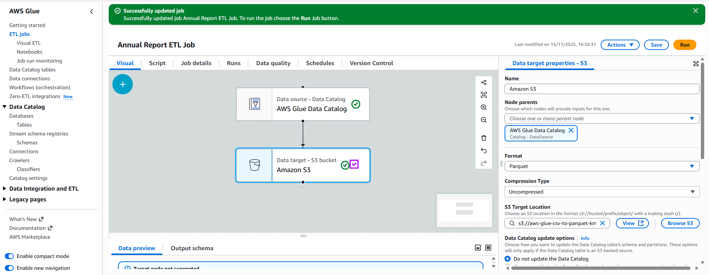

# Why convert from CSV to Parquet?

Parquet is a columnar-store filetype, meaning columns of data are stored physically together on disk. Whereas, CSV is a row-store filetype where rows of data are stored together.

The latter is beneficial when you want to view/delete entire rows at once. However, for many analytical purposes, columnar store excels in querying time and costs.

# Workflow

EMR and Glue are the two main services for converting from CSV to Parquet. Since we are not dealing with big data, it would be overkill to setup and EMR cluster so we will rely on a on-demand Glue ETL (Extract Transform Load) job.

1. Upload CSV data to S3. (You can find CSVs at https://www.stats.govt.nz/large-datasets/csv-files-for-download/)
2. Before we can run the ETL job, use Glue's crawlers to create table definitions of your data. This allows us to load the data for the ETL job in the next step.
3. Define your ETL job; I have used the GUI
   

but you could also use script-mode...

```
import sys
from awsglue.transforms import *
from awsglue.utils import getResolvedOptions
from pyspark.context import SparkContext
from awsglue.context import GlueContext
from awsglue.job import Job
from awsgluedq.transforms import EvaluateDataQuality

args = getResolvedOptions(sys.argv, ['JOB_NAME'])
sc = SparkContext()
glueContext = GlueContext(sc)
spark = glueContext.spark_session
job = Job(glueContext)
job.init(args['JOB_NAME'], args)

# Default ruleset used by all target nodes with data quality enabled
DEFAULT_DATA_QUALITY_RULESET = """
    Rules = [
        ColumnCount > 0
    ]
"""

# Script generated for node AWS Glue Data Catalog
AWSGlueDataCatalog_node1763215001118 = glueContext.create_dynamic_frame.from_catalog(database="annual-reports", table_name="csv_reports", transformation_ctx="AWSGlueDataCatalog_node1763215001118")

# Script generated for node Amazon S3
EvaluateDataQuality().process_rows(frame=AWSGlueDataCatalog_node1763215001118, ruleset=DEFAULT_DATA_QUALITY_RULESET, publishing_options={"dataQualityEvaluationContext": "EvaluateDataQuality_node1763214873977", "enableDataQualityResultsPublishing": True}, additional_options={"dataQualityResultsPublishing.strategy": "BEST_EFFORT", "observations.scope": "ALL"})
AmazonS3_node1763215209453 = glueContext.write_dynamic_frame.from_options(frame=AWSGlueDataCatalog_node1763215001118, connection_type="s3", format="glueparquet", connection_options={"path": "s3://aws-glue-csv-to-parquet-km/target-data-store/parquet-reports/", "partitionKeys": []}, format_options={"compression": "uncompressed"}, transformation_ctx="AmazonS3_node1763215209453")

job.commit()
```

4. Run your ETL job. Your Parquet file will output in the S3 target location specified in the Target step of your job.
