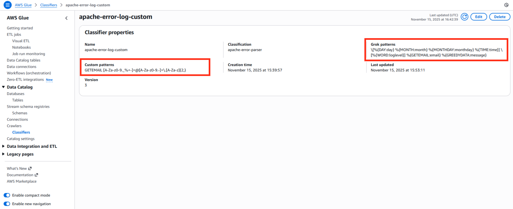
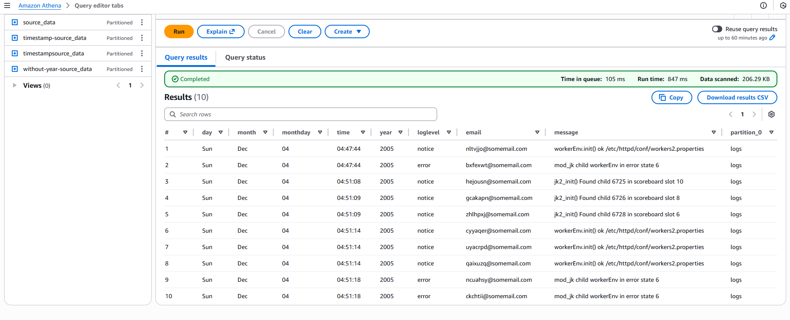

# Workflow

We start with a .log file, consisting of unstructured text data. We would like to query this data, for example using Amazon Athena, to find all log messages in the month of December <br>

1. Upload log file to S3.
2. Create a table definition for this log file

- Create a custom Grok classifier in AWS Glue. This classifier will parse each line of the file, by looking for matches against regular expressions. The regular expressions that are searched for are defined by the Grok patterns parameter. Most of these are built-in patterns, with the exception of GETEMAIL which has been supplied as a custom pattern.
  

- Create a Glue crawler, attaching our custom classifier. When prompted, choose an appropriate target database where this table definition will be stored. Run the crawler.

3. Use Amazon Athena to query your Glue tables. Example SQL query:

```
SELECT *
FROM "logs"."source_data" -- table name
WHERE "month" = 'Dec'
LIMIT 10;
```


