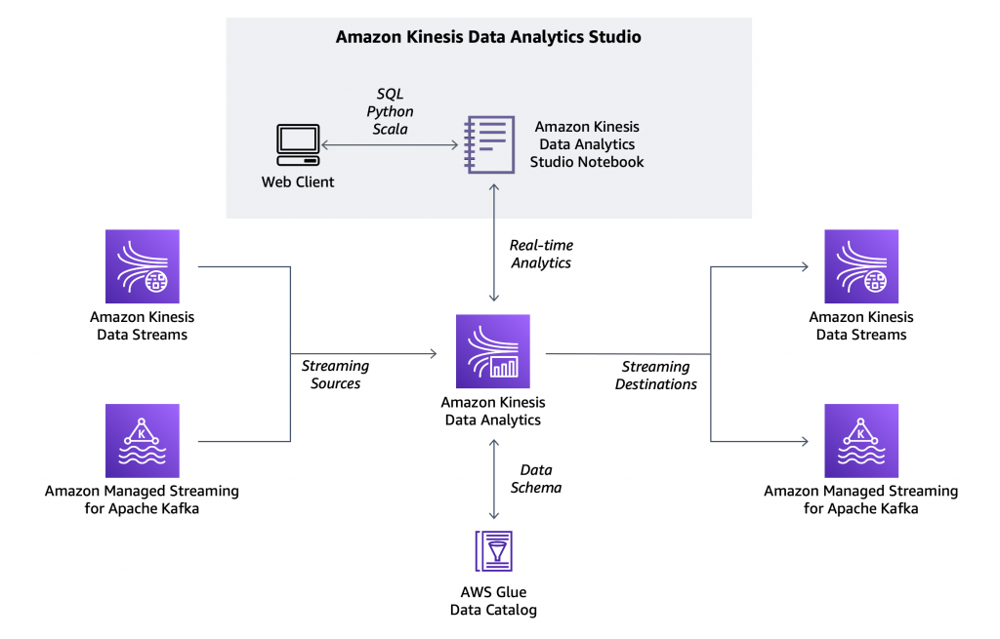

# About

I have followed the workflow as explained in this very nicely written <a href="https://aws.amazon.com/blogs/aws/introducing-amazon-kinesis-data-analytics-studio-quickly-interact-with-streaming-data-using-sql-python-or-scala/?sc_channel=EL&sc_campaign=Demo_Deep_Dive_2021_vid&sc_medium=YouTube&sc_content=Video9639&sc_detail=ANALYTICS&sc_country=US">blog</a>

To summarise, we are:

1. Ingesting data using Kinesis Data Streams
2. Using Apache Flink to do real-time data analysis (using SQL)
3. Dumping this manipulated data into a S3 bucket

`put-records.py` rapidly sends JSON records into the Kinesis input stream. Then, run `notebook.ipynb` in Apache Flink.

# Considerations

To run `notebook.ipynb`, your Apache Flink instance must have the correct IAM permissions to read/write to AWS Glue tables & Kinesis input/output streams.
