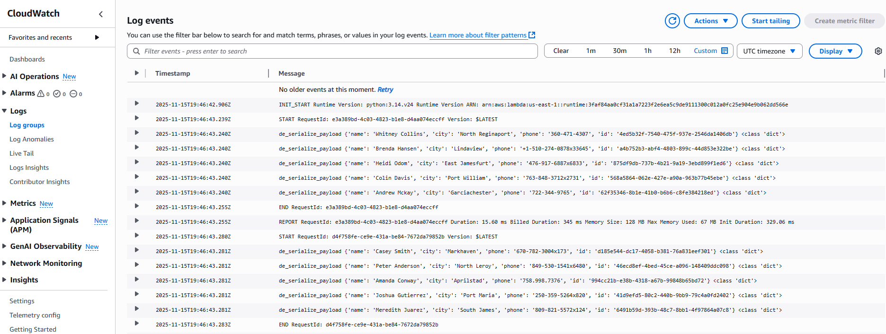

# About

`put-records.py` demonstrate how to put records into a Kinesis Data Stream using the boto3 SDK. To see these records, we will trigger a Lambda function to print records in the stream. Below is our Lambda trigger config:

And the CloudWatch logs for our Lambda:

You'll notice two separate Lambda invocations. This is because we have put 10 records into the stream but only specified a batch size of 5 in our Lambda trigger config. Hence, two Lambda invocations are needed to satisfy 2 batches of 5 records.
